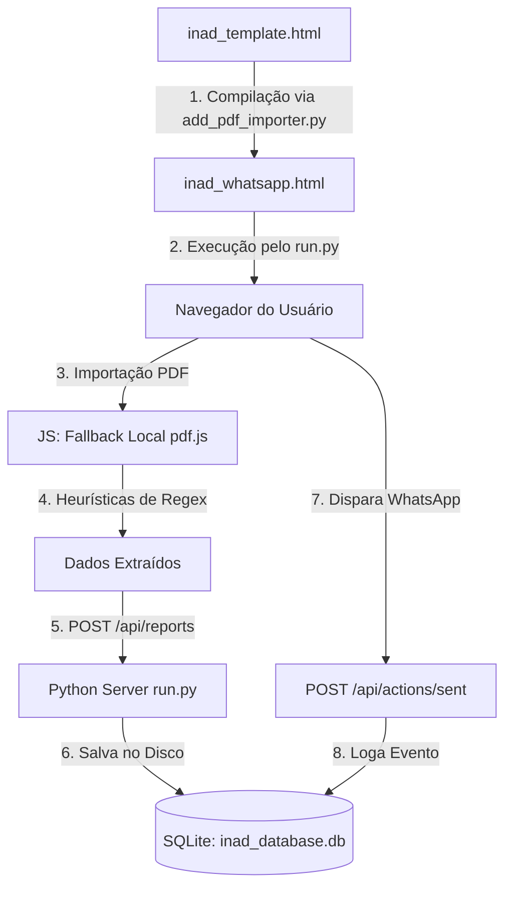

# 🤖 Contexto do Sistema para Inteligência Artificial (AI_CONTEXT.md)

Este documento descreve a arquitetura, regras de negócio, esquema de banco de dados e especificações técnicas deste projeto. Ele foi projetado para ser fornecido a **qualquer modelo de linguagem (I.A.)** para que ela compreenda instantaneamente o funcionamento do sistema e possa realizar manutenções ou adicionar novas features com precisão.

---

## 📌 Visão Geral do Projeto (INAD — Painel de Cobrança)
O projeto é um painel de cobrança para regularização de clientes inadimplentes. Ele permite importar relatórios em PDF de atrasos, extrair os dados cadastrais (clientes, imóveis e parcelas), gerar mensagens de cobrança pré-formatadas para o WhatsApp e monitorar os KPIs (Key Performance Indicators) de recuperação de forma cronológica.

---

## 🏗️ Arquitetura do Software e Fluxo de Dados
O sistema adota uma arquitetura híbrida de persistência e compilação:



1.  **Código-Fonte Principal:** [inad_template.html](file:///Users/dimas/Documents/AntiGravity/inad_template.html) contém a interface do usuário (HTML/JS/CSS) com as regras de renderização. **AIs não devem editar o inad_whatsapp.html diretamente**, apenas o template.
2.  **Compilador Python:** [add_pdf_importer.py](file:///Users/dimas/Documents/AntiGravity/add_pdf_importer.py) lê o template e injeta um JSON inicial (se houver) no placeholder `CLIENTS_JSON_PLACEHOLDER` para gerar o `inad_whatsapp.html`.
3.  **Servidor & API REST:** [run.py](file:///Users/dimas/Documents/AntiGravity/run.py) inicia um servidor local Python que fornece endpoints de API e gerencia o banco de dados **SQLite** relacional (`inad_database.db`).
4.  **Fallback Offline-First:** Se o painel for aberto diretamente pelo arquivo (`file://`), o frontend reverte silenciosamente e salva tudo no `localStorage` do navegador.

---

## 🗄️ Esquema do Banco de Dados (SQLite)
O banco de dados relacional é inicializado automaticamente pelo `run.py` no arquivo `inad_database.db` com a seguinte estrutura:

```sql
-- 1. Relatórios Históricos
CREATE TABLE reports (
    id INTEGER PRIMARY KEY AUTOINCREMENT,
    report_name TEXT NOT NULL,         -- Nome amigável do relatório
    report_date TEXT,                  -- Data de emissão real extraída do PDF (Formato YYYY-MM-DD)
    imported_at TIMESTAMP DEFAULT CURRENT_TIMESTAMP
);

-- 2. Clientes Inadimplentes do Relatório
CREATE TABLE clients (
    id INTEGER PRIMARY KEY AUTOINCREMENT,
    report_id INTEGER,
    name TEXT NOT NULL,                -- Nome completo do cliente
    cpf_cnpj TEXT,
    cel TEXT,                          -- Telefone celular prioritário
    email TEXT,
    FOREIGN KEY(report_id) REFERENCES reports(id) ON DELETE CASCADE
);

-- 3. Imóveis Relacionados
CREATE TABLE properties (
    id INTEGER PRIMARY KEY AUTOINCREMENT,
    client_id INTEGER,
    venda_id TEXT NOT NULL,            -- ID da venda (usado para logar ações)
    identifier TEXT NOT NULL,          -- Identificação física (Ex: QUADRA 15 LOTE 12)
    FOREIGN KEY(client_id) REFERENCES clients(id) ON DELETE CASCADE
);

-- 4. Parcelas em Atraso
CREATE TABLE parcels (
    id INTEGER PRIMARY KEY AUTOINCREMENT,
    property_id INTEGER,
    parcela TEXT NOT NULL,             -- Número da parcela (Ex: 90/180)
    vencimento TEXT NOT NULL,          -- Vencimento abreviado (DD/MM)
    vencimento_full TEXT NOT NULL,     -- Vencimento completo (DD/MM/YYYY)
    FOREIGN KEY(property_id) REFERENCES properties(id) ON DELETE CASCADE
);

-- 5. Histórico de Disparos de WhatsApp
CREATE TABLE action_logs (
    id INTEGER PRIMARY KEY AUTOINCREMENT,
    venda_id TEXT NOT NULL,            -- ID da venda contatada
    client_name TEXT NOT NULL,         -- Nome do cliente contatado
    sent_at TIMESTAMP DEFAULT CURRENT_TIMESTAMP
);
```

---

## 🔌 Especificação da API REST (Python Server)
Todos os endpoints são servidos em `http://localhost:8000`:

### `GET /api/reports`
Retorna todos os relatórios históricos importados.
*   **Response:** `[{"id": 1, "report_name": "Julho/2026", "report_date": "2026-07-17", "imported_at": "2026-07-17 14:00:00"}, ...]`

### `GET /api/reports/<id>`
Retorna a árvore completa de clientes e imóveis daquele relatório específico (id correspondente).
*   **Response:** JSON estruturado de clientes (idêntico ao formato legador do frontend).

### `POST /api/reports`
Adiciona um novo relatório contendo a árvore de dados extraída.
*   **Payload:** `{"report_name": "...", "report_date": "YYYY-MM-DD", "clients": { ... }}`

### `POST /api/actions/sent`
Registra que uma mensagem foi enviada pelo WhatsApp.
*   **Payload:** `{"venda_id": "...", "client_name": "..."}`

### `GET /api/actions/sent`
Retorna uma lista única com os nomes de todos os clientes que já receberam mensagens.
*   **Response:** `["Cliente A", "Cliente B"]`

### `GET /api/kpis`
Retorna as métricas de regularização calculadas.
*   **Response:**
    *   `evolution`: Evolução histórica da inadimplência (número de clientes, imóveis e parcelas por data de relatório).
    *   `transitions`: Cruzamentos entre relatórios ordenados cronologicamente por `report_date`.

---

## 📈 Lógica e Fórmulas Matemáticas dos KPIs
Os KPIs cruzam a existência de inadimplentes em relatórios sequenciais (ordenados por `report_date`) para calcular a eficiência real das ações:

*   **Taxa de Recuperação Geral:**
    $$\text{Taxa} = \frac{\text{Clientes em } R_n \text{ que NÃO constam em } R_{n+1}}{\text{Total de Clientes em } R_n} \times 100$$
*   **Conversão de Clientes Cobrados:**
    Clientes que constavam no relatório $R_n$, receberam WhatsApp no intervalo de datas entre $R_n$ e $R_{n+1}$, e **não** estão no relatório $R_{n+1}$.
*   **Conversão de Clientes Não Cobrados (Orgânico):**
    Clientes que constavam no relatório $R_n$, **não** receberam mensagens, e regularizaram seus débitos no relatório $R_{n+1}$.
*   **Eficácia das Cobranças (Lift):**
    $$\text{Lift} = \text{Conversão de Cobrados} - \text{Conversão de Não Cobrados}$$
    *Nota: Se o Lift for positivo (ex: +15%), a cobrança ativa via WhatsApp está funcionando e gerando resultados.*

---

## 🔍 Regras de Parsing e Validação de PDF (RegEx)

Ao processar relatórios PDF, o frontend utiliza heurísticas baseadas em linhas de texto plano ordenadas verticalmente:
1.  **Extração de Data de Emissão:** Localiza a data de emissão do PDF pelo padrão:
    `/(segunda-feira|terça-feira|quarta-feira|quinta-feira|sexta-feira|sábado|domingo),\s+(\d{1,2})\s+de\s+(janeiro|fevereiro|março|abril|maio|junho|julho|agosto|setembro|outubro|novembro|dezembro)\s+de\s+(\d{4})/i`
2.  **Mapeamento de Clientes & Vendas:**
    *   Identifica um bloco de cliente ao encontrar a linha `Venda:\s+(\d+)` e a linha seguinte `Cliente:\s+(.+)`.
    *   A regularização de telefone prioriza Celular > Residencial > Comercial.
    *   Aplica **overrides cadastrais** fixados no código Javascript (ex: Maria Dalva, Stefanny) para corrigir dados incorretos da base legada antes de renderizar as mensagens.

---

## 💡 Diretrizes para Novas I.As que Trabalharem no Projeto
Se você é uma I.A. encarregada de fazer alterações neste repositório, siga estritamente estas diretrizes:
1.  **Edite apenas inad_template.html:** Nunca faça alterações de interface diretamente no `inad_whatsapp.html`. Após editar o template, execute o script `python3 add_pdf_importer.py` para gerar o arquivo final.
2.  **Mantenha o SQLite Limpo de Dependências:** Não instale dependências de banco de dados pesadas (como psycopg2 ou mysql-connector). O SQLite nativo via biblioteca padrão `sqlite3` é obrigatório para manter a portabilidade em executáveis portáteis.
3.  **Segurança em Primeiro Lugar:** Nunca remova a regra de ignorar arquivos `.db`, `.json` e `.pdf` no arquivo `.gitignore`. O repositório Git deve permanecer livre de quaisquer dados reais de clientes.
4.  **Preserve o Fallback Offline:** Ao editar o javascript do frontend, certifique-se de que a lógica continue tratando o fallback para `localStorage` caso o protocolo de acesso seja `file://` (uso direto sem inicializar o servidor de banco de dados).
