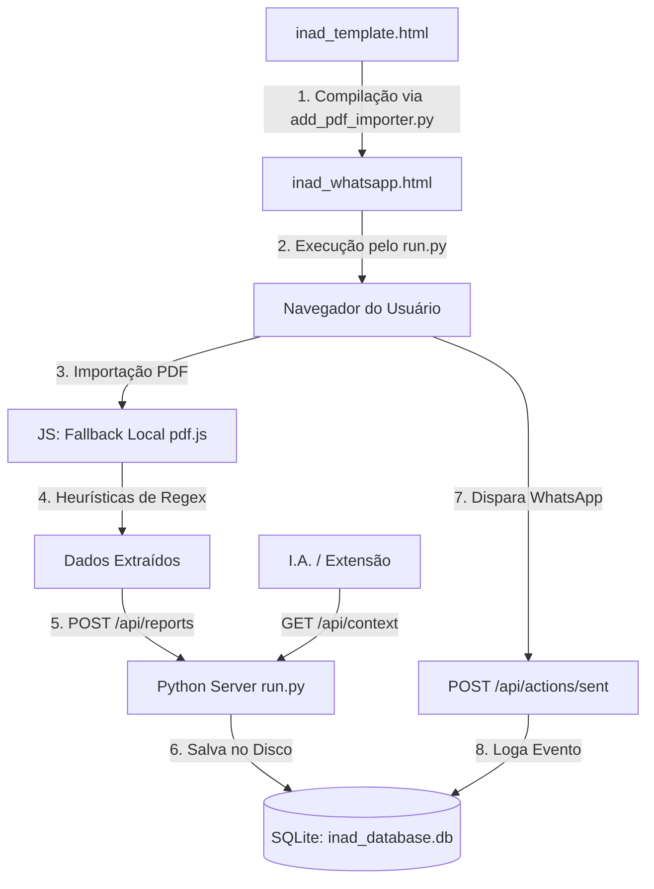

# 🤖 Contexto do Sistema para Inteligência Artificial (AI_CONTEXT.md)

Este documento descreve a arquitetura, regras de negócio, esquema de banco de dados e especificações técnicas deste projeto. Ele foi projetado para ser fornecido a **qualquer modelo de linguagem (I.A.)** para que ela compreenda instantaneamente o funcionamento do sistema e possa realizar manutenções ou adicionar novas features com precisão.

> **Endpoint em tempo real:** com o servidor ativo (`python3 run.py`), acesse `GET http://localhost:8000/api/context` para obter este contexto em JSON, incluindo estatísticas ao vivo do banco.

---

## 📌 Visão Geral do Projeto (INAD — Painel de Cobrança)

O projeto é um painel de cobrança para regularização de clientes inadimplentes. Ele permite importar relatórios em PDF de atrasos, extrair os dados cadastrais (clientes, imóveis e parcelas), gerar mensagens de cobrança pré-formatadas para o WhatsApp e monitorar os KPIs (Key Performance Indicators) de recuperação de forma cronológica.

---

## 🏗️ Arquitetura do Software e Fluxo de Dados

O sistema adota uma arquitetura híbrida de persistência e compilação:



### Arquivos principais

| Arquivo | Função |
|---------|--------|
| `inad_template.html` | **Fonte da UI** (HTML/JS/CSS). IAs devem editar **apenas este arquivo**. |
| `add_pdf_importer.py` | Compilador: injeta `CLIENTS_JSON_PLACEHOLDER` → gera `inad_whatsapp.html` |
| `inad_whatsapp.html` | **Artefato gerado** — não editar manualmente |
| `run.py` | Servidor HTTP + API REST + SQLite |
| `inad_database.db` | Banco local (não versionado no Git) |
| `AI_CONTEXT.md` | Este documento |
| `extension/` | Extensão Chrome (Gemini Copilot) — opcional, separada do painel |

### Fluxo de compilação do frontend

```bash
# Após qualquer alteração em inad_template.html:
python3 add_pdf_importer.py
```

---

## 🗄️ Esquema do Banco de Dados (SQLite)

O banco é inicializado automaticamente pelo `run.py` em `inad_database.db`:

```sql
-- 1. Relatórios Históricos
CREATE TABLE reports (
    id          INTEGER PRIMARY KEY AUTOINCREMENT,
    report_name TEXT    NOT NULL,
    report_date TEXT,                  -- Data real do PDF (YYYY-MM-DD)
    imported_at TIMESTAMP DEFAULT CURRENT_TIMESTAMP
);

-- 2. Clientes Inadimplentes
CREATE TABLE clients (
    id          INTEGER PRIMARY KEY AUTOINCREMENT,
    report_id   INTEGER NOT NULL,
    name        TEXT    NOT NULL,
    cpf_cnpj    TEXT    DEFAULT '',
    cel         TEXT    DEFAULT '',
    email       TEXT    DEFAULT '',
    FOREIGN KEY(report_id) REFERENCES reports(id) ON DELETE CASCADE
);

-- 3. Imóveis
CREATE TABLE properties (
    id          INTEGER PRIMARY KEY AUTOINCREMENT,
    client_id   INTEGER NOT NULL,
    venda_id    TEXT    NOT NULL,
    identifier  TEXT    NOT NULL,
    FOREIGN KEY(client_id) REFERENCES clients(id) ON DELETE CASCADE
);

-- 4. Parcelas em Atraso
CREATE TABLE parcels (
    id              INTEGER PRIMARY KEY AUTOINCREMENT,
    property_id     INTEGER NOT NULL,
    parcela         TEXT    NOT NULL,
    vencimento      TEXT    NOT NULL,
    vencimento_full TEXT    NOT NULL,
    FOREIGN KEY(property_id) REFERENCES properties(id) ON DELETE CASCADE
);

-- 5. Histórico de Disparos WhatsApp
CREATE TABLE action_logs (
    id          INTEGER PRIMARY KEY AUTOINCREMENT,
    venda_id    TEXT    NOT NULL,
    client_name TEXT    NOT NULL,
    sent_at     TIMESTAMP DEFAULT CURRENT_TIMESTAMP
);

-- 6. Exclusões manuais de KPI (clientes ignorados nas métricas)
CREATE TABLE kpi_exclusions (
    client_name TEXT PRIMARY KEY
);
```

---

## 🔌 Especificação da API REST

Servidor padrão: `http://localhost:8000` (porta configurável via `INAD_PORT`).

### Contexto e saúde

| Método | Rota | Descrição |
|--------|------|-----------|
| `GET` | `/api/context` | Contexto estruturado completo para IAs (schema, regras, stats ao vivo, markdown) |
| `GET` | `/api/health` | `{status, port, platform, python}` |

### Relatórios e clientes

| Método | Rota | Descrição |
|--------|------|-----------|
| `GET` | `/api/reports` | Lista relatórios `[{id, report_name, report_date, imported_at}]` |
| `GET` | `/api/reports/<id>` | Árvore de clientes/imóveis/parcelas do relatório |
| `POST` | `/api/reports` | Importa relatório `{report_name, report_date, clients: {...}}` |
| `DELETE` | `/api/reports/<id>` | Exclui relatório (CASCADE em clientes, imóveis, parcelas) |
| `GET` | `/api/clients` | Clientes do relatório mais recente |
| `POST` | `/api/clients` | Alias de `POST /api/reports` |
| `GET` | `/api/clients/all` | Lista única de nomes de clientes (todos os relatórios) |

### Ações de cobrança

| Método | Rota | Descrição |
|--------|------|-----------|
| `GET` | `/api/sent` | Nomes de clientes já contatados |
| `GET` | `/api/actions/sent` | Alias de `/api/sent` |
| `POST` | `/api/sent` | Registra envio: `{venda_id, client_name}` ou lista de nomes |
| `POST` | `/api/actions/sent` | Alias de `POST /api/sent` |

### KPIs

| Método | Rota | Descrição |
|--------|------|-----------|
| `GET` | `/api/kpis` | Métricas de evolução e transições. Query opcional: `?reports=1,2,3` |
| `GET` | `/api/kpis/exclusions` | Lista clientes excluídos dos KPIs |
| `POST` | `/api/kpis/exclusions` | `{client_name, exclude: true\|false}` |

**Resposta de `/api/kpis`:**
- `evolution` — evolução filtrada (relatórios selecionados, sem duplicados)
- `all_evolution` — todos os relatórios, incluindo flag `is_duplicate`
- `transitions` — cruzamentos entre relatórios consecutivos

---

## 📈 Lógica dos KPIs

### Deduplicação por data

Relatórios com a mesma `report_date` são considerados duplicados. Mantém-se apenas o **ID mais recente**; os demais recebem `is_duplicate: true` e são desmarcados automaticamente na UI de KPIs.

### Taxa de recuperação

$$\text{Taxa} = \frac{\text{Clientes em } R_n \text{ que NÃO constam em } R_{n+1}}{\text{Total de Clientes em } R_n} \times 100$$

### Exclusões

Clientes presentes em `kpi_exclusions` são **ignorados** em todos os cálculos de KPI (contagens, transições, gráficos).

### Seleção de relatórios

Na aba KPI, o usuário pode marcar/desmarcar relatórios individualmente. A query `?reports=1,3,5` filtra quais entram no cálculo de `evolution` e `transitions`.

---

## 🔍 Regras de Parsing de PDF (RegEx)

O frontend (`inad_template.html`) processa PDFs client-side:

1. **Data de emissão:** padrão `(segunda-feira|...|domingo), DD de MÊS de YYYY`
2. **Bloco de cliente:** linha `Venda: (\d+)` seguida de `Cliente: (.+)`
3. **Telefone:** prioridade Celular > Residencial > Comercial
4. **Overrides cadastrais:** correções fixas no JS para clientes com dados incorretos no PDF legado

---

## 💾 Fallback Offline (`file://`)

Se o painel for aberto sem servidor (`file://`), o frontend usa `localStorage`:

| Chave | Conteúdo |
|-------|----------|
| `inad_clients_db` | Dados de clientes |
| `inad_sent` | Clientes marcados como enviados |
| `inad_kpi_exclusions` | Exclusões de KPI |

**Regra:** qualquer alteração no JS deve preservar este fallback.

---

## 💡 Diretrizes para I.As

1. **Edite apenas `inad_template.html`** — regenere com `python3 add_pdf_importer.py`.
2. **SQLite nativo** — sem ORMs, sem psycopg2/mysql-connector.
3. **Privacidade** — nunca commitar `.db`, `.json` com dados reais ou PDFs.
4. **Retrocompatibilidade** — manter aliases `/api/sent` ↔ `/api/actions/sent`.
5. **Contexto ao vivo** — consulte `GET /api/context` antes de alterações que afetem API ou schema.
6. **Escopo mínimo** — alterações focadas; não refatorar código não relacionado à tarefa.

---

## 🚀 Execução

```bash
python3 run.py                    # Porta 8000, abre navegador
INAD_PORT=9090 python3 run.py     # Porta customizada
INAD_HEADLESS=1 python3 run.py    # Sem abrir navegador (servidor)
python3 run.py --headless         # Igual ao headless
```

Painel: `http://localhost:8000/inad_whatsapp.html`
