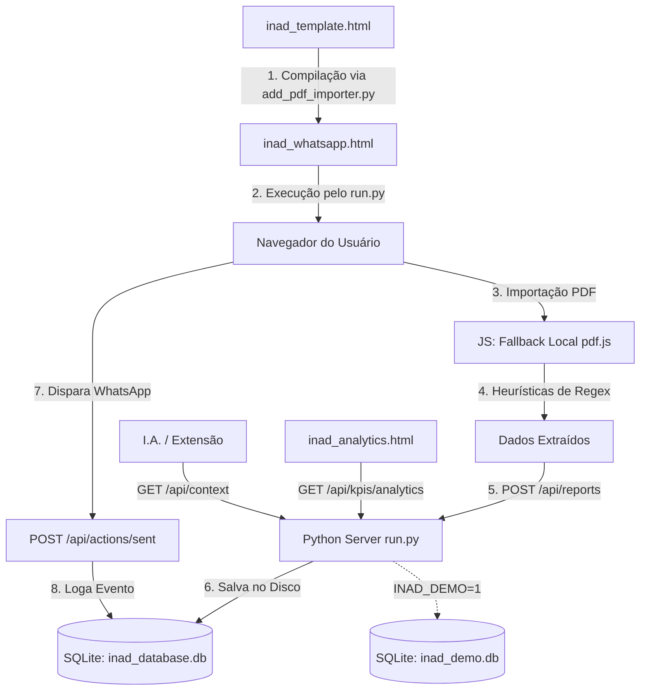

# 🤖 Contexto do Sistema para Inteligência Artificial (AI_CONTEXT.md)

Este documento descreve a arquitetura, regras de negócio, esquema de banco de dados e especificações técnicas deste projeto. Ele foi projetado para ser fornecido a **qualquer modelo de linguagem (I.A.)** para que ela compreenda instantaneamente o funcionamento do sistema e possa realizar manutenções ou adicionar novas features com precisão.

> **Endpoint em tempo real:** com o servidor ativo (`python3 run.py`), acesse `GET http://localhost:8000/api/context` para obter este contexto em JSON, incluindo estatísticas ao vivo do banco.

---

## 📌 Visão Geral do Projeto (INAD — Painel de Cobrança)

O projeto é um painel de cobrança para regularização de clientes inadimplentes, alimentado por relatórios do ERP de construtoras **ProUAU**. Ele permite importar relatórios em PDF de atrasos, extrair os dados cadastrais (clientes, imóveis e parcelas com valores em R$), gerar mensagens de cobrança pré-formatadas para o WhatsApp e monitorar os KPIs de recuperação de forma cronológica — incluindo uma página dedicada de **Analytics** com segmentação de clientes novos/antigos e filtros por período.

---

## 🏗️ Arquitetura do Software e Fluxo de Dados

O sistema adota uma arquitetura híbrida de persistência e compilação:



### Arquivos principais

| Arquivo | Função |
|---------|--------|
| `inad_template.html` | **Fonte da UI principal** (HTML/JS/CSS). Editar **apenas este arquivo** para o painel de cobrança. |
| `add_pdf_importer.py` | Compilador: injeta `CLIENTS_JSON_PLACEHOLDER` → gera `inad_whatsapp.html` |
| `inad_whatsapp.html` | **Artefato gerado** — não editar manualmente |
| `inad_analytics.html` + `analytics.css` + `analytics.js` | **Página de Analytics** — estática, fora do passo de compilação; consome a API ao vivo (não funciona via `file://`) |
| `run.py` | Servidor HTTP + API REST + SQLite |
| `generate_demo_data.py` | Gerador de dados fictícios para o banco demo (`inad_demo.db`) |
| `inad_database.db` | Banco real (não versionado no Git) |
| `inad_demo.db` | Banco demo isolado (não versionado no Git) |
| `libs/` | Bibliotecas vendorizadas: `pdf.min.js`, `pdf.worker.min.js`, `chart.umd.min.js` (Chart.js v4) — todas com fallback CDN |
| `AI_CONTEXT.md` | Este documento |
| `extension/` | Extensão Chrome (Gemini Copilot) — opcional, separada do painel |

### Fluxo de compilação do frontend

```bash
# Após qualquer alteração em inad_template.html:
python3 add_pdf_importer.py
# inad_analytics.html / analytics.css / analytics.js NÃO passam pela compilação —
# são servidos diretamente e podem ser editados livremente.
```

---

## 🗄️ Esquema do Banco de Dados (SQLite)

O banco é inicializado automaticamente pelo `run.py` (`inad_database.db`, ou `inad_demo.db` em modo demo):

```sql
-- 1. Relatórios Históricos
CREATE TABLE reports (
    id          INTEGER PRIMARY KEY AUTOINCREMENT,
    report_name TEXT    NOT NULL,
    report_date TEXT,                  -- Data real do PDF (YYYY-MM-DD)
    imported_at TIMESTAMP DEFAULT CURRENT_TIMESTAMP
);

-- 2. Clientes Inadimplentes
CREATE TABLE clients (
    id          INTEGER PRIMARY KEY AUTOINCREMENT,
    report_id   INTEGER NOT NULL,
    name        TEXT    NOT NULL,
    cpf_cnpj    TEXT    DEFAULT '',
    cel         TEXT    DEFAULT '',
    email       TEXT    DEFAULT '',
    FOREIGN KEY(report_id) REFERENCES reports(id) ON DELETE CASCADE
);

-- 3. Imóveis
CREATE TABLE properties (
    id          INTEGER PRIMARY KEY AUTOINCREMENT,
    client_id   INTEGER NOT NULL,
    venda_id    TEXT    NOT NULL,
    identifier  TEXT    NOT NULL,
    FOREIGN KEY(client_id) REFERENCES clients(id) ON DELETE CASCADE
);

-- 4. Parcelas em Atraso
CREATE TABLE parcels (
    id              INTEGER PRIMARY KEY AUTOINCREMENT,
    property_id     INTEGER NOT NULL,
    parcela         TEXT    NOT NULL,
    vencimento      TEXT    NOT NULL,
    vencimento_full TEXT    NOT NULL,
    valor           REAL    DEFAULT 0.0,   -- Valor monetário (R$) da parcela
    FOREIGN KEY(property_id) REFERENCES properties(id) ON DELETE CASCADE
);

-- 5. Histórico de Disparos WhatsApp
CREATE TABLE action_logs (
    id          INTEGER PRIMARY KEY AUTOINCREMENT,
    venda_id    TEXT    NOT NULL,
    client_name TEXT    NOT NULL,
    sent_at     TIMESTAMP DEFAULT CURRENT_TIMESTAMP
);

-- 6. Exclusões manuais de KPI (clientes ignorados nas métricas)
CREATE TABLE kpi_exclusions (
    client_name TEXT PRIMARY KEY
);

-- Índices (criados idempotentemente pelo init_db)
CREATE INDEX idx_clients_name         ON clients(name);
CREATE INDEX idx_clients_report_id    ON clients(report_id);
CREATE INDEX idx_properties_client_id ON properties(client_id);
CREATE INDEX idx_parcels_property_id  ON parcels(property_id);
```

> **Identidade de cliente:** não existe tabela canônica de clientes — a identidade é por **string exata de `name`** entre relatórios. Variações de grafia/acento (ex.: "GONCALVES" vs "GONÇALVES") são tratadas como clientes distintos. Limitação conhecida e aceita.

---

## 🔌 Especificação da API REST

Servidor padrão: `http://localhost:8000` (porta configurável via `INAD_PORT`).

### Contexto e saúde

| Método | Rota | Descrição |
|--------|------|-----------|
| `GET` | `/api/context` | Contexto estruturado completo para IAs (schema, regras, stats ao vivo, markdown) |
| `GET` | `/api/health` | `{status, port, platform, python, demo, db_file}` |

### Relatórios e clientes

| Método | Rota | Descrição |
|--------|------|-----------|
| `GET` | `/api/reports` | Lista relatórios `[{id, report_name, report_date, imported_at}]` |
| `GET` | `/api/reports/<id>` | Árvore de clientes/imóveis/parcelas (com `valor`) do relatório |
| `POST` | `/api/reports` | Importa relatório `{report_name, report_date, clients: {...}}` |
| `DELETE` | `/api/reports/<id>` | Exclui relatório (CASCADE em clientes, imóveis, parcelas) |
| `GET` | `/api/clients` | Clientes do relatório mais recente |
| `POST` | `/api/clients` | Alias de `POST /api/reports` |
| `GET` | `/api/clients/all` | Lista única de nomes de clientes (todos os relatórios) |

### Ações de cobrança

| Método | Rota | Descrição |
|--------|------|-----------|
| `GET` | `/api/sent` | Nomes de clientes já contatados |
| `GET` | `/api/actions/sent` | Alias de `/api/sent` |
| `POST` | `/api/sent` | Registra envio: `{venda_id, client_name}` ou lista de nomes |
| `POST` | `/api/actions/sent` | Alias de `POST /api/sent` |

### KPIs e Analytics

| Método | Rota | Descrição |
|--------|------|-----------|
| `GET` | `/api/kpis` | Métricas de evolução e transições (aba KPI). Query opcional: `?reports=1,2,3` |
| `GET` | `/api/kpis/analytics` | Série temporal segmentada para a página de Analytics (ver abaixo) |
| `GET` | `/api/kpis/exclusions` | Lista clientes excluídos dos KPIs |
| `POST` | `/api/kpis/exclusions` | `{client_name, exclude: true\|false}` |

**Resposta de `/api/kpis`:** `evolution` (filtrada, sem duplicados), `all_evolution` (com flag `is_duplicate`), `transitions` (cruzamentos consecutivos). Cada entrada de evolução inclui `total_value` (soma R$ das parcelas).

**`GET /api/kpis/analytics` — parâmetros (todos opcionais, combináveis):**

| Param | Exemplo | Efeito |
|-------|---------|--------|
| `start` / `end` | `2026-01-01` / `2026-07-19` | Intervalo de datas dos relatórios exibidos |
| `reports` | `1,3,5` | Restringe a IDs específicos (interseção com o intervalo) |
| `segment` | `all` \| `novo` \| `antigo` | Dica para o frontend (a resposta sempre traz os 3 recortes) |
| `cutoff` | `2026-05-01` | Data de corte para "novo" |
| `cutoff_last_n` | `3` | Alternativa: corte = data do N-ésimo relatório mais recente (default: 1) |

**Resposta:**
```json
{
  "meta": { "cutoff_date", "cutoff_mode", "segment_filter", "date_range",
            "available_date_range", "data_version" },
  "series": [ { "report_id", "report_name", "report_date", "is_duplicate",
                "total":  {"clients","properties","parcels","total_value"},
                "novo":   {...}, "antigo": {...} } ],
  "transitions": [ { "from_report","to_report","from_date","to_date",
                     "total_clients","recovered_clients","recovery_rate",
                     "recovery_rate_novo","recovery_rate_antigo","recovered_value" } ],
  "segment_totals": { "novo": {"clients","total_value"}, "antigo": {...} }
}
```

`meta.data_version` muda a cada importação/exclusão de relatório — o frontend faz polling barato disso para exibir "novos dados disponíveis".

---

## 📈 Lógica dos KPIs

### Deduplicação por data

Relatórios com a mesma `report_date` são considerados duplicados. Mantém-se apenas o **ID mais recente**; os demais recebem `is_duplicate: true` e são desmarcados automaticamente na UI de KPIs.

### Taxa de recuperação

$$\text{Taxa} = \frac{\text{Clientes em } R_n \text{ que NÃO constam em } R_{n+1}}{\text{Total de Clientes em } R_n} \times 100$$

### Segmentação novo vs antigo

Um cliente é **"novo"** se sua **primeira aparição em qualquer relatório do histórico** (`MIN(report_date)` por nome exato, CTE `first_seen` em `run.py`) ocorreu **na data de corte ou depois**; caso contrário é **"antigo"**. O corte é configurável por data (`cutoff`) ou pelos N últimos relatórios (`cutoff_last_n`).

**Regra crítica:** a primeira aparição é calculada sempre sobre **todo o histórico**, nunca restrita pelo filtro de datas da tela — senão clientes antigos seriam rotulados erroneamente como novos dentro de janelas recentes.

### Exclusões

Clientes presentes em `kpi_exclusions` são **ignorados** em todos os cálculos de KPI e Analytics (contagens, transições, valores, gráficos). Seed inicial versionado em `kpi_exclusions.json`.

### Seleção de relatórios

Na aba KPI e na página de Analytics, o usuário pode marcar/desmarcar relatórios individualmente (`?reports=1,3,5`).

---

## 🧪 Modo Demo / Sandbox

Para testar sem tocar no banco real:

```bash
python3 generate_demo_data.py --reset   # (Re)cria inad_demo.db com dados fictícios
INAD_DEMO=1 python3 run.py              # Servidor apontando SÓ para inad_demo.db
python3 run.py --demo                   # Equivalente
```

- `INAD_DEMO=1` (ou `--demo`) troca `DB_PATH` para `inad_demo.db` — **nada lê ou grava** `inad_database.db` nesse modo.
- Em demo, `init_db()` **não roda** migração de JSONs legados, backfill de `clients_data.json` nem seed de `kpi_exclusions.json` (dados reais jamais entram no banco demo).
- `/api/health` e `/api/context` retornam `"demo": true`; a página de Analytics exibe o banner "⚠ MODO DEMO".
- O gerador é determinístico (seed 42; `--seed N` para variar): ~15 relatórios mensais com churn de 10-20%, ~80 clientes fictícios (incluindo variações propositais de grafia para exercitar a limitação de identidade por nome), valores R$ 300-5.000 por parcela.
- `inad_demo.db` está coberto pelo `.gitignore` (`*.db`).

---

## 🔍 Regras de Parsing de PDF (RegEx)

O frontend (`inad_template.html`) processa PDFs client-side:

1. **Data de emissão:** padrão `(segunda-feira|...|domingo), DD de MÊS de YYYY`
2. **Bloco de cliente:** linha `Venda: (\d+)` seguida de `Cliente: (.+)`
3. **Telefone:** prioridade Celular > Residencial > Comercial
4. **Overrides cadastrais:** correções fixas no JS para clientes com dados incorretos no PDF legado

---

## 💾 Fallback Offline (`file://`)

Se o painel principal for aberto sem servidor (`file://`), o frontend usa `localStorage`:

| Chave | Conteúdo |
|-------|----------|
| `inad_clients_db` | Dados de clientes |
| `inad_sent` | Clientes marcados como enviados |
| `inad_kpi_exclusions` | Exclusões de KPI |

**Regra:** qualquer alteração no JS do painel principal deve preservar este fallback. A **página de Analytics não tem fallback offline** — ela depende do servidor por design.

---

## 💡 Diretrizes para I.As

1. **Painel principal:** edite apenas `inad_template.html` — regenere com `python3 add_pdf_importer.py`. **Analytics:** edite `inad_analytics.html`/`analytics.css`/`analytics.js` diretamente (sem compilação).
2. **SQLite nativo** — sem ORMs, sem psycopg2/mysql-connector.
3. **Privacidade** — nunca commitar `.db` (nem `-shm`/`-wal`), `.json` com dados reais ou PDFs. O `.gitignore` cobre tudo isso.
4. **Retrocompatibilidade** — manter aliases `/api/sent` ↔ `/api/actions/sent` e a forma da resposta de `/api/kpis` (a aba KPI depende dela); features novas de análise vão em `/api/kpis/analytics`.
5. **Contexto ao vivo** — consulte `GET /api/context` antes de alterações que afetem API ou schema.
6. **Escopo mínimo** — alterações focadas; não refatorar código não relacionado à tarefa.
7. **Testes com dados fake** — use o modo demo (`INAD_DEMO=1` + `generate_demo_data.py`), nunca o banco real.

---

## 🚀 Execução

```bash
python3 run.py                     # Porta 8000, abre navegador
INAD_PORT=9090 python3 run.py      # Porta customizada
INAD_HEADLESS=1 python3 run.py     # Sem abrir navegador (servidor)
python3 run.py --headless          # Igual ao headless
INAD_DEMO=1 python3 run.py         # Modo demo (banco isolado inad_demo.db)
python3 generate_demo_data.py --reset   # Popula o banco demo com dados fictícios
```

Painel: `http://localhost:8000/inad_whatsapp.html`
Analytics: `http://localhost:8000/inad_analytics.html`
