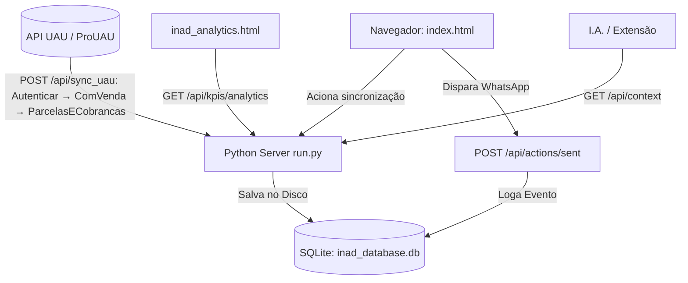

# 🤖 Contexto do Sistema para Inteligência Artificial (AI_CONTEXT.md)

Este documento descreve a arquitetura, regras de negócio, esquema de banco de dados e especificações técnicas deste projeto. Ele foi projetado para ser fornecido a **qualquer modelo de linguagem (I.A.)** para que ela compreenda instantaneamente o funcionamento do sistema e possa realizar manutenções ou adicionar novas features com precisão.

> **Endpoint em tempo real:** com o servidor ativo (`python3 run.py`), acesse `GET http://localhost:8000/api/context` para obter este contexto em JSON, incluindo estatísticas ao vivo do banco.

## 🤖 Custom Agent Rules

### Planning Mode Rules
- Sempre ative o Modo de Planejamento (`implementation_plan.md`) antes de realizar análises de dados grandes, como testes em bancos `.db`, validações/testes de KPIs e testes de integração com APIs.
- Monte o plano detalhado primeiro para permitir a revisão e a troca para modelos mais rápidos antes da execução dos testes.

### Temporary Function Toggles & Modifications
- Ao solicitar o desligamento ou modificação de uma função, verifique o histórico recente do Git e as alterações locais (`git diff`) para identificar exatamente onde e como a função está implementada antes de modificá-la.

---

## 📌 Visão Geral do Projeto (INAD — Painel de Cobrança)

O projeto é um painel de cobrança para regularização de clientes inadimplentes, alimentado pelo ERP de construtoras **ProUAU** (Senior Cloud). A arquitetura é **API-First**: o sistema sincroniza a inadimplência diretamente da API do UAU (somente leitura), grava os dados cadastrais (clientes, imóveis e parcelas com valores em R$) no SQLite local, gera mensagens de cobrança pré-formatadas para o WhatsApp e monitora os KPIs de recuperação de forma cronológica — incluindo uma página dedicada de **Analytics** com segmentação de clientes novos/antigos e filtros por período.

> ⚠️ **Nota de Desempenho & Testes:** A sincronização com a API do UAU (`POST /api/sync_uau`) é um processo intrinsecamente **lento** (pode levar alguns minutos dependendo do tamanho da base), pois realiza requisições iterativas para consultar as parcelas e cobranças por CPF/titular. Para fins de teste e validação, utilize chamadas leves/debug (como o parâmetro `{"debug": true}`) para apenas verificar o recebimento de resposta da API sem a necessidade de executar importações completas no banco.


## 🏗️ Arquitetura do Software e Fluxo de Dados

O sistema é API-First: sincroniza da API UAU (leitura) e persiste em SQLite local.



### Arquivos principais

| Arquivo | Função |
|---------|--------|
| `index.html` | **Interface do painel de cobrança** (HTML/JS/CSS). |
| `inad_analytics.html` + `analytics.css` + `analytics.js` | **Página de Analytics** — estática; consome a API ao vivo |
| `run.py` | Servidor HTTP + API REST + SQLite |
| `inad_database.db` | Banco real (não versionado no Git) |
| `libs/` | Bibliotecas vendorizadas: `chart.umd.min.js` (Chart.js v4) |
| `AI_CONTEXT.md` | Este documento |
| `extension/` | Extensão Chrome (Gemini Copilot) — opcional, separada do painel |

### Frontend

O frontend é um único arquivo (`index.html`, HTML/JS/CSS inline) editado e servido
diretamente — não há etapa de compilação. `inad_analytics.html` / `analytics.css` /
`analytics.js` também são servidos diretamente.

---

## 🗄️ Esquema do Banco de Dados (SQLite)

O banco é inicializado automaticamente pelo `run.py` (`inad_database.db`):

```sql
-- 1. Relatórios Históricos
CREATE TABLE reports (
    id          INTEGER PRIMARY KEY AUTOINCREMENT,
    report_name TEXT    NOT NULL,
    report_date TEXT,                  -- Data de emissão do relatório (YYYY-MM-DD)
    imported_at TIMESTAMP DEFAULT CURRENT_TIMESTAMP
);

-- 2. Clientes Inadimplentes
CREATE TABLE clients (
    id          INTEGER PRIMARY KEY AUTOINCREMENT,
    report_id   INTEGER NOT NULL,
    name        TEXT    NOT NULL,
    cpf_cnpj    TEXT    DEFAULT '',
    cel         TEXT    DEFAULT '',
    email       TEXT    DEFAULT '',
    FOREIGN KEY(report_id) REFERENCES reports(id) ON DELETE CASCADE
);

-- 3. Imóveis
CREATE TABLE properties (
    id          INTEGER PRIMARY KEY AUTOINCREMENT,
    client_id   INTEGER NOT NULL,
    venda_id    TEXT    NOT NULL,
    identifier  TEXT    NOT NULL,
    FOREIGN KEY(client_id) REFERENCES clients(id) ON DELETE CASCADE
);

-- 4. Parcelas em Atraso
CREATE TABLE parcels (
    id              INTEGER PRIMARY KEY AUTOINCREMENT,
    property_id     INTEGER NOT NULL,
    parcela         TEXT    NOT NULL,
    vencimento      TEXT    NOT NULL,
    vencimento_full TEXT    NOT NULL,
    valor           REAL    DEFAULT 0.0,   -- Valor monetário (R$) da parcela
    FOREIGN KEY(property_id) REFERENCES properties(id) ON DELETE CASCADE
);

-- 5. Histórico de Disparos WhatsApp
CREATE TABLE action_logs (
    id          INTEGER PRIMARY KEY AUTOINCREMENT,
    venda_id    TEXT    NOT NULL,
    client_name TEXT    NOT NULL,
    sent_at     TIMESTAMP DEFAULT CURRENT_TIMESTAMP
);

-- 6. Exclusões manuais de KPI (clientes ignorados nas métricas)
CREATE TABLE kpi_exclusions (
    client_name TEXT PRIMARY KEY
);

-- 7. Desfechos de contato (outcomes)
CREATE TABLE contact_outcomes (
    id            INTEGER PRIMARY KEY AUTOINCREMENT,
    client_name   TEXT    NOT NULL,
    venda_id      TEXT    DEFAULT '',
    action_log_id INTEGER,
    outcome       TEXT    NOT NULL,
    promised_date TEXT,
    next_contact  TEXT,
    note          TEXT    DEFAULT '',
    created_at    TIMESTAMP DEFAULT CURRENT_TIMESTAMP
);

-- 8. Operadores (autenticação mínima — só relevante quando exposto além de
-- localhost; ver _authenticate()/--add-operator em run.py)
CREATE TABLE operators (
    id         INTEGER PRIMARY KEY AUTOINCREMENT,
    name       TEXT    NOT NULL UNIQUE,
    token_hash TEXT    NOT NULL,
    created_at TIMESTAMP DEFAULT CURRENT_TIMESTAMP,
    active     INTEGER NOT NULL DEFAULT 1
);

-- 9. Auditoria de acesso a PII individual (S6) — quem consultou o perfil
-- (CPF/telefone/endereço) de qual cliente e quando. Só alimentada por
-- GET /api/clients/profile (leitura de UM cliente) — não por
-- GET /api/reports/<id> (leitura em lote, uso rotineiro do painel).
CREATE TABLE access_audit (
    id          INTEGER PRIMARY KEY AUTOINCREMENT,
    operator    TEXT,
    client_name TEXT    NOT NULL,
    accessed_at TIMESTAMP DEFAULT CURRENT_TIMESTAMP
);

-- Índices (criados idempotentemente pelo init_db)
CREATE INDEX idx_clients_name         ON clients(name);
CREATE INDEX idx_clients_report_id    ON clients(report_id);
CREATE INDEX idx_properties_client_id ON properties(client_id);
CREATE INDEX idx_parcels_property_id  ON parcels(property_id);
CREATE INDEX idx_parcels_venc         ON parcels(vencimento_full);
CREATE INDEX idx_outcomes_client      ON contact_outcomes(client_name);
CREATE INDEX idx_outcomes_created     ON contact_outcomes(created_at);
CREATE INDEX idx_access_audit_client   ON access_audit(client_name);
CREATE INDEX idx_access_audit_accessed ON access_audit(accessed_at);
```

> **Identidade de cliente:** não existe tabela canônica de clientes — o `name`/`client_name` original (como veio do PDF ou foi digitado) é sempre preservado para exibição. Para **comparações de identidade** entre relatórios/tabelas (dedup, recovery_rate, segmentação novo/antigo, exclusões de KPI, reentradas), todo o sistema usa `normalize_name()` (`run.py`): remove acentos, colapsa espaços e uniformiza caixa — "GONÇALVES" e "Goncalves " contam como o mesmo cliente. Abreviações (ex.: "Ma." vs "Maria") continuam fora do escopo dessa normalização puramente textual.

---

## 🔌 Especificação da API REST

Servidor padrão: `http://localhost:8000` (porta configurável via `INAD_PORT`).

### Atalhos de navegação

`http://localhost:8000/` e outras rotas amigáveis fazem redirect 302 para o arquivo estático certo — evita "connection refused"/404 ao digitar só a raiz:

| Rota | Redireciona para |
|------|-------------------|
| `/` | `/index.html` |
| `/kpi`, `/kpis` | `/index.html#kpi` |
| `/cobranca`, `/painel` | `/index.html#cobranca` |
| `/analytics`, `/analitico` | `/inad_analytics.html` |

### Contexto e saúde

| Método | Rota | Descrição |
|--------|------|-----------|
| `GET` | `/api/context` | Contexto estruturado completo para IAs (schema, regras, stats ao vivo, markdown) |
| `GET` | `/api/health` | `{status, port, platform, python, db_file}` |

### Relatórios e clientes

| Método | Rota | Descrição |
|--------|------|-----------|
| `GET` | `/api/reports` | Lista relatórios `[{id, report_name, report_date, imported_at}]` |
| `GET` | `/api/reports/<id>` | Árvore de clientes/imóveis/parcelas (com `valor`) do relatório |
| `POST` | `/api/reports` | Importa relatório `{report_name, report_date, clients: {...}}` |
| `DELETE` | `/api/reports/<id>` | Exclui relatório (CASCADE em clientes, imóveis, parcelas) |
| `GET` | `/api/clients` | Clientes do relatório mais recente |
| `POST` | `/api/clients` | Alias de `POST /api/reports` |
| `POST` | `/api/sync_uau` | Sincroniza inadimplência da API UAU (somente leitura) `{empresa?, obra?}` |
| `GET` | `/api/clients/all` | Lista única de nomes de clientes (todos os relatórios) |

### Ações de cobrança

| Método | Rota | Descrição |
|--------|------|-----------|
| `GET` | `/api/sent` | Nomes de clientes já contatados |
| `GET` | `/api/actions/sent` | Alias de `/api/sent` |
| `POST` | `/api/sent` | Registra envio: `{venda_id, client_name}` ou lista de nomes |
| `POST` | `/api/actions/sent` | Alias de `POST /api/sent` |

### KPIs e Analytics

| Método | Rota | Descrição |
|--------|------|-----------|
| `GET` | `/api/kpis` | Métricas de evolução e transições (aba KPI). Query opcional: `?reports=1,2,3` |
| `GET` | `/api/kpis/analytics` | Série temporal segmentada para a página de Analytics (ver abaixo) |
| `GET` | `/api/kpis/exclusions` | Lista clientes excluídos dos KPIs |
| `POST` | `/api/kpis/exclusions` | `{client_name, exclude: true\|false}` |

**Resposta de `/api/kpis`:** `evolution` (filtrada, sem duplicados), `all_evolution` (com flag `is_duplicate`), `transitions` (cruzamentos consecutivos). Cada entrada de evolução inclui `total_value` (soma R$ das parcelas). Cada transição traz `recovery_rate` ("saiu do relatório seguinte" — sinal amplo, não implica pagamento) e, ao lado, `recovery_rate_confirmed`/`recovered_confirmed_clients` (K6: subconjunto com desfecho `pagou` registrado) — as duas convivem, nenhuma substitui a outra.

**`GET /api/kpis/analytics` — parâmetros (todos opcionais, combináveis):**

| Param | Exemplo | Efeito |
|-------|---------|--------|
| `start` / `end` | `2026-01-01` / `2026-07-19` | Intervalo de datas dos relatórios exibidos |
| `reports` | `1,3,5` | Restringe a IDs específicos (interseção com o intervalo) |
| `segment` | `all` \| `novo` \| `antigo` | Dica para o frontend (a resposta sempre traz os 3 recortes) |
| `cutoff` | `2026-05-01` | Data de corte para "novo" |
| `cutoff_last_n` | `3` | Alternativa: corte = data do N-ésimo relatório mais recente (default: 1) |

**Resposta:**
```json
{
  "meta": { "cutoff_date", "cutoff_mode", "segment_filter", "date_range",
            "available_date_range", "data_version" },
  "series": [ { "report_id", "report_name", "report_date", "is_duplicate",
                "total":  {"clients","properties","parcels","total_value"},
                "novo":   {...}, "antigo": {...} } ],
  "transitions": [ { "from_report","to_report","from_date","to_date",
                     "total_clients","recovered_clients","recovery_rate",
                     "recovery_rate_novo","recovery_rate_antigo","recovered_value",
                     "recovered_confirmed_clients","recovery_rate_confirmed" } ],
  "segment_totals": { "novo": {"clients","total_value"}, "antigo": {...} }
}
```

`meta.data_version` muda a cada importação/exclusão de relatório — o frontend faz polling barato disso para exibir "novos dados disponíveis".

### 📊 Riscos, Fila e Alertas Operacionais (v3.0.0)

| Método | Rota | Descrição |
|--------|------|-----------|
| `GET` | `/api/queue` | Retorna a fila priorizada por score de risco DESC `queue` (?stage&min_days&limit=50) |
| `GET` | `/api/clients/profile` | Dossiê detalhado do devedor, timeline de presença, logs e desfechos (?name) |
| `POST` | `/api/outcomes` | Registra desfecho de contato `{client_name, outcome, venda_id?, action_log_id?, promised_date?, next_contact?, note?}` |
| `GET` | `/api/outcomes` | Lista todos os desfechos registrados (?name&limit=100) |
| `DELETE` | `/api/outcomes/<id>` | Remove um registro de desfecho (correções e auditoria) |
| `GET` | `/api/worklist` | Alertas operacionais categorizados em listas de prioridades |
| `GET` | `/api/summary` | Snapshot consolidado de KPIs financeiros, metas de contatos e conversão (?top=5) |
| `GET` | `/api/audit` | Trilha de auditoria (S6): quem consultou o perfil/PII de qual cliente e quando (?name&limit=100) |

#### Formato JSON `/api/queue`
```json
{
  "meta": { "reference_date": "YYYY-MM-DD", "report_id": 1, "report_date": "YYYY-MM-DD", "data_version": "..." },
  "queue": [
    {
      "name": "ANA SILVA SANTOS", "cel": "(62) 9...", "email": "...", "venda_ids": ["12345"],
      "total_owed": 18450.20, "avg_parcel": 1240.5, "n_properties": 2, "n_parcels": 14,
      "max_days_overdue": 143, "bucket": "120+", "stage": "pre_juridico",
      "reentries": 2, "risk_score": 82.3,
      "components": {"valor": 0.91, "aging": 1.0, "reincidencia": 0.67},
      "last_contact": "2026-07-10 18:22:10", "last_outcome": "sem_resposta",
      "promised_date": null, "next_contact": null
    }
  ]
}
```

#### Formato JSON `/api/clients/profile`
```json
{
  "meta": { "reference_date": "...", "report_id": 1, "report_date": "...", "data_version": "..." },
  "name": "FABIO COSTA SILVA", "cel": "...", "email": "...", "cpf_cnpj": "...",
  "financials": {
    "total_owed": 12500.0, "avg_parcel": 2500.0, "n_properties": 1, "n_parcels": 5,
    "oldest_due": "2026-02-10", "max_days_overdue": 143,
    "buckets": {
      "0-30": {"parcels": 2, "value": 2400.0},
      "31-60": {"parcels": 0, "value": 0.0},
      "61-90": {"parcels": 0, "value": 0.0},
      "91-120": {"parcels": 0, "value": 0.0},
      "120+": {"parcels": 3, "value": 10100.0}
    }
  },
  "risk": { "score": 82.3, "components": {"valor": 0.91, "aging": 1.0, "reincidencia": 0.67}, "stage": "pre_juridico", "bucket": "120+" },
  "recurrence": {
    "first_seen": "2025-03-31", "reentries": 2, "currently_present": true,
    "timeline": [{"report_date": "2025-03-31", "present": true}, ...]
  },
  "contacts": [{"sent_at": "2026-07-10 18:00:00", "venda_id": "12345"}],
  "outcomes": [{"id": 7, "outcome": "prometeu_pagar", "promised_date": "2026-07-15", "next_contact": null, "note": "...", "created_at": "..."}],
  "response_behavior": { "contacted_times": 3, "regularized_after_contact": false, "days_since_last_contact": 9 },
  "properties": [{"venda_id": "12345", "identifier": "QD 01 LT 02", "parcels": [...]}]
}
```

#### Formato JSON `/api/worklist`
Categoriza clientes ativos sob regras de prioridades sequenciais (evitando duplicar trabalho na tela):
```json
{
  "meta": { "reference_date": "...", "report_id": 1, "report_date": "...", "data_version": "..." },
  "promessas_vencidas": [ { ... queue_row_shape ..., "days_late_on_promise": 4 } ],
  "recontato_agendado": [ { ... queue_row_shape ... } ],
  "sem_resposta":       [ { ... queue_row_shape ..., "days_since_contact": 14 } ],
  "novos_pre_juridico": [ { ... queue_row_shape ..., "entered_bucket": true } ]
}
```

#### Formato JSON `/api/summary`
```json
{
  "meta": { "reference_date": "...", "report_id": 1, "report_date": "...", "data_version": "..." },
  "current": {"clients": 87, "total_owed": 412300.5, "avg_days_overdue": 74},
  "trend": {"vs_previous_report": {"clients_delta": -4, "value_delta": -18200.0, "direction": "melhora"}},
  "aging_distribution": {"0-30": {"clients": 20, "value": 24000.0}, ..., "120+": {...}},
  "pre_juridico": {"count": 12, "value": 98000.0, "new_this_report": 3},
  "top_debtors": [ {"name": "ANA SILVA", "total_owed": 25000.0, "max_days_overdue": 145, "stage": "pre_juridico"} ],
  "effectiveness": {"contacted": 60, "regularized_after_contact": 22, "rate": 36.7, "promises_made": 15, "promises_kept": 6},
  "worklist_counts": {"promessas_vencidas": 4, "sem_resposta": 9, "novos_pre_juridico": 3}
}
```

---

## 📈 Lógica dos KPIs e Regras de Risco (v3.0.0)

### Deduplicação por data

Relatórios com a mesma `report_date` são considerados duplicados. Mantém-se apenas o **ID mais recente**; os demais recebem `is_duplicate: true` e são desmarcados automaticamente na UI de KPIs.

### Taxa de recuperação

$$\text{Taxa} = \frac{\text{Clientes em } R_n \text{ que NÃO constam em } R_{n+1}}{\text{Total de Clientes em } R_n} \times 100$$

Este é o sinal **amplo** ("saiu do relatório seguinte") — não implica pagamento confirmado; o cliente pode ter renegociado fora do sistema, sido encaminhado ao jurídico, ou ter saído por um artefato de dado. **`recovery_rate_confirmed`** (K6, decisão do responsável: as duas métricas convivem, nenhuma substitui a outra) reporta ao lado a fração desse mesmo conjunto que tem um desfecho `pagou` registrado em `contact_outcomes` (`_confirmed_paid_names()` em `run.py`) — presente em `get_kpis_data()` e `get_analytics_data()`.

### Segmentação novo vs antigo

Um cliente é **"novo"** se sua **primeira aparição em qualquer relatório do histórico** (`MIN(report_date)` por identidade normalizada — `normalize_name()`, K2 — CTE `first_seen` em `run.py`) ocorreu **na data de corte ou depois**; caso contrário é **"antigo"**. O corte é configurável por data (`cutoff`) ou pelos N últimos relatórios (`cutoff_last_n`).

**Regra crítica:** a primeira aparição é calculada sempre sobre **todo o histórico**, nunca restrita pelo filtro de datas da tela — senão clientes antigos seriam rotulados erroneamente como novos dentro de janelas recentes.

### Exclusões

Clientes presentes em `kpi_exclusions` são **ignorados** em todos os cálculos de KPI e Analytics (contagens, transições, valores, gráficos). Seed inicial versionado em `kpi_exclusions.json`.

### Seleção de relatórios

Na aba KPI e na página de Analytics, o usuário pode marcar/desmarcar relatórios individualmente (`?reports=1,3,5`).

### Score de Risco (0 a 100)

O score de risco operacional de cada inadimplente é calculado de forma puramente matemática e explicável com base na fórmula:

$$\text{Score} = 45 \times V + 35 \times A + 20 \times R$$

* **Componente V (Valor)**: $\min(\text{total\_owed} / P90\text{ da carteira}, 1.0)$ — proporcional à exposição financeira do cliente.
* **Componente A (Aging)**: $\min(\text{max\_days\_overdue} / 180, 1.0)$ — mede o tempo do atraso mais antigo (satura com 180 dias).
* **Componente R (Reincidência)**: $\min(\text{reentry\_count} / 3, 1.0)$ — mede a quantidade de reentradas do cliente na lista após ter saído dela (satura em 3 retornos).

### Estágios de Cobrança (`STAGES`)

A régua de cobrança é dividida em 4 estágios baseados no tempo máximo de atraso do devedor:
1. **`lembrete`** ($\le 30$ dias): Lembrete amigável.
2. **`firme`** ($31 - 90$ dias): Cobrança firme.
3. **`serio`** ($91 - 120$ dias): Cobrança séria.
4. **`pre_juridico`** ($> 120$ dias): Encaminhamento pré-jurídico.

### Política de Data de Referência (Aging Reference Date)

* **Visão Operacional (Queue, Worklist, Profile, Stages)**: O cálculo de atraso em dias (`max_days_overdue`) é calculado em relação à **data local do servidor (hoje)**. Isso garante que a fila sempre mostre quem deve ser cobrado *agora*, e que os débitos continuem a acumular atrasos enquanto não houver um novo relatório.
* **Visão Analítica Histórica (KPIs, Analytics)**: O cálculo do envelhecimento de um relatório pretérito é feito com base na **data de emissão do próprio relatório (`report_date`)**. Isso garante que os dados analíticos históricos sejam reproduzíveis e consistentes no tempo.

---

## ⚖️ Conformidade e Termos de Uso (Artigo 42 do CDC)

Conforme o CDC art. 42, a cobrança não pode expor o cliente a ridículo, constrangimento ou ameaça. Todos os templates — inclusive o de pré-jurídico — devem ser factuais, respeitosos e limitados aos dados do débito (parcelas, valores, vencimentos) e a canais de regularização. O template pré-jurídico deve informar que o caso "poderá ser encaminhado ao setor jurídico" — nunca ameaçar processo, negativação ou perda do imóvel. No financiamento com alienação fiduciária (Lei 9.514/97), os passos formais (notificação via cartório, purga da mora) são atos jurídicos conduzidos por humanos/advogados; a ferramenta não automatiza nenhum passo legal — o estágio pre_juridico é apenas uma fila interna para triagem humana e entrega ao jurídico. Isto não é aconselhamento jurídico.

### Segurança de dados pessoais (LGPD) — auditoria e criptografia (S6)

- **Autenticação por operador** (`operators`): só é exigida quando o servidor está exposto além de localhost (`INAD_HOST`/`--host`); em bind loopback (padrão), sempre autorizado como operador `"local"`.
- **Trilha de auditoria** (`access_audit`, decisão do responsável): toda leitura de `GET /api/clients/profile` — que expõe CPF/telefone/endereço de UM cliente específico — é registrada (`operator`, `client_name`, `accessed_at`) via `_log_access()`. Consultável via `GET /api/audit`. Leituras em lote (`GET /api/reports/<id>`, usada no uso rotineiro do painel) **não** são logadas, para a trilha não virar ruído.
- **Criptografia at-rest** (SQLCipher): avaliada e **não implementada** — decisão do responsável de confiar na criptografia de disco do sistema operacional (FileVault/BitLocker) em vez de adicionar essa complexidade (gestão de chave/senha, rebuild do empacotamento PyInstaller por plataforma). Não reabrir sem nova decisão explícita.

---

## 🗺️ Roadmap de Integrações Futuras

* **Detecção automática de respostas do WhatsApp**: A infraestrutura atual baseada na tabela `contact_outcomes` e no endpoint `/api/worklist` serve como base estrutural. No futuro, um módulo ingestor de respostas do WhatsApp poderá ler mensagens recebidas e produzir registros na tabela `contact_outcomes` automaticamente (ex.: identificar que o cliente respondeu com uma promessa de pagamento ou agendou retorno).

---

## 🔍 Sincronização com a API UAU (`POST /api/sync_uau`)

Integração **somente leitura** com o ERP UAU (credenciais em `.env`:
`UAU_BASE_URL`, `UAU_USUARIO`, `UAU_SENHA`, `UAU_X_INTEGRATION`). Só a máquina Windows
alcança o endpoint. Fluxo (em `run.py`, `_sync_from_uau`):

**`UAU_VALOR_MINIMO`** (opcional, `.env`): valor mínimo em R$ de parcela vencida para
entrar no painel — descarta parcelas irrisórias (impostos, taxas, micro-renegociações).
Default `0` = não filtra nada. O filtro é **por parcela individual**, não pelo total da
dívida: um cliente cujas parcelas vencidas fiquem TODAS abaixo do mínimo some do painel
mesmo que a soma seja relevante. **Cuidado:** alterar esse valor no meio do histórico de
relatórios distorce `recovery_rate` e demais KPIs (um cliente pode "sumir" não porque
pagou, mas porque a parcela caiu abaixo do novo mínimo).

**Auto-sync (background):** os endpoints `GET /api/autosync/status` e `POST
/api/autosync/toggle` ligam/desligam uma thread que roda o sync periodicamente. **Não há
superfície de UI** para isso por decisão intencional (o operador padrão é somente-leitura);
são operados apenas via API/infra.

1. **Autenticar** — `POST Autenticador/AutenticarUsuario` (`Login`/`Senha` + header `X-INTEGRATION-Authorization`) → token usado como header `Authorization`.
2. **Enumerar titulares** — `POST Pessoas/ConsultarPessoasComVenda` com filtro `empresa`/`obra` (evita puxar tudo).
3. **Parcelas por CPF** — `POST Recebiveis/ParcelasECobrancasDoCliente` (`ValorReajustado=true`) → `Vendas → ParcelasVenda`.
4. **Inadimplência** — mantém só parcelas com `DataVencimento` < hoje; grava report/clients/properties/parcels.

Regras: **nunca** usar endpoints de escrita do UAU (`GravarPessoa`, `ManterTelefone`, `Alterar*`);
puxar enxuto (sem fan-out pesado de `Pessoas/*`); seguir a API como documentada.

---

## 💾 Fallback Offline (`file://`)

Se o painel principal for aberto sem servidor (`file://`), o frontend usa `localStorage`:

| Chave | Conteúdo |
|-------|----------|
| `inad_clients_db` | Dados de clientes |
| `inad_sent` | Clientes marcados como enviados |
| `inad_kpi_exclusions` | Exclusões de KPI |

**Regra:** qualquer alteração no JS do painel principal deve preservar este fallback. A **página de Analytics não tem fallback offline** — ela depende do servidor por design.

---

## 💡 Diretrizes para I.As

1. **Painel principal:** edite `index.html`. **Analytics:** edite `inad_analytics.html`/`analytics.css`/`analytics.js` diretamente.
2. **SQLite nativo** — sem ORMs, sem psycopg2/mysql-connector.
3. **Privacidade** — nunca commitar `.db` (nem `-shm`/`-wal`), `.json` com dados reais ou o `.env` (credenciais UAU). O `.gitignore` cobre tudo isso.
4. **Retrocompatibilidade** — manter aliases `/api/sent` ↔ `/api/actions/sent` e a forma da resposta de `/api/kpis` (a aba KPI depende dela); features novas de análise vão em `/api/kpis/analytics`.
5. **Contexto ao vivo** — consulte `GET /api/context` antes de alterações que afetem API ou schema.
6. **Escopo mínimo** — alterações focadas; não refatorar código não relacionado à tarefa.
7. **Testes com dados fake** — use `tests/test_golden_kpis.py` (fixtures determinísticas + reconciliação em bancos SQLite temporários), nunca o banco real.

---

## 🚀 Execução

```bash
python3 run.py                     # Porta 8000, abre navegador
INAD_PORT=9090 python3 run.py      # Porta customizada
INAD_HEADLESS=1 python3 run.py     # Sem abrir navegador (servidor)
python3 run.py --headless          # Igual ao headless
```

Painel: `http://localhost:8000/` (redireciona automaticamente para `index.html`)
Analytics: `http://localhost:8000/analytics` (ou diretamente `/inad_analytics.html`)
