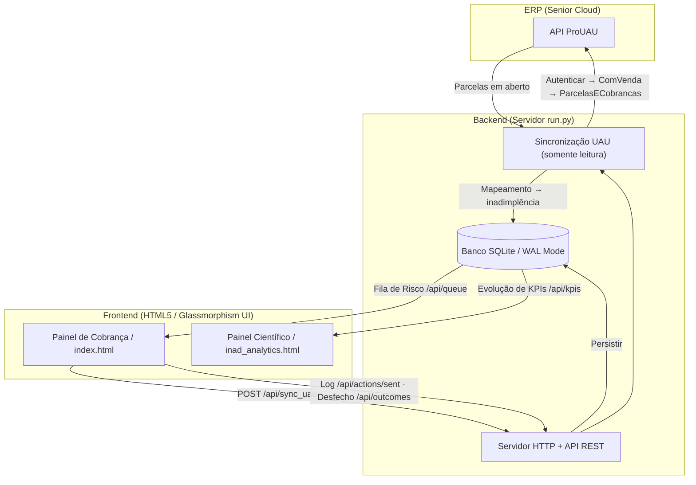

# 🏡 INAD — Painel de Gestão e Cobrança de Inadimplência

[](https://www.python.org/)
[](https://www.sqlite.org/)
[](https://developer.mozilla.org/en-US/docs/Web/CSS)
[](https://pyinstaller.org/)
[](#)

Ferramenta profissional de CRM e gestão de cobrança para automatizar o fluxo de recuperação de inadimplência da construtora. A arquitetura é **API-First**: o sistema sincroniza a inadimplência **diretamente da API do ERP ProUAU (Senior Cloud)** — em modo **somente leitura** — calcula scores de risco, classifica devedores em réguas de cobrança operacionais e facilita contatos dinâmicos via WhatsApp Web.

> [!IMPORTANT]
> **Privacidade & Segurança (LGPD):** Toda a manipulação de dados é realizada **localmente no seu computador** ou na **Intranet da sua empresa** — nunca na nuvem. A integração com o UAU é **exclusivamente de leitura** (consulta de clientes e parcelas; o sistema nunca escreve no ERP). O banco SQLite (`inad_database.db`) fica no próprio servidor local. Acesso pela rede exige cadastro individual por operador (sem usuário/senha compartilhado) e fica registrado numa trilha de auditoria interna. Veja [🔒 Segurança e Privacidade](#-segurança-e-privacidade).

---

## 📐 Arquitetura do Sistema

Servidor Python leve que sincroniza a inadimplência da API UAU para um SQLite local e serve o painel (HTML/JS/CSS de arquivo único):



---

## ✨ Funcionalidades Principais

- 🔄 **Sincronização nativa com o UAU (`/api/sync_uau`):** puxa os clientes titulares de venda (com filtro por empresa/obra) e suas parcelas em aberto direto do ERP, calcula a inadimplência (parcelas vencidas) e monta o relatório automaticamente — sem planilhas nem importação manual. **Somente leitura**: nada é gravado no ERP.
- 📊 **Fila de Prioridades Inteligente (`/api/queue`):** ordenação dinâmica calculada a partir do cruzamento de valor devedor (P90), dias de atraso (aging) e taxa de reincidência entre relatórios.
- 📋 **Worklist Operacional:** categorização imediata de clientes que precisam de ação:
  - *Promessas Vencidas:* prometeram pagar mas não quitaram no prazo.
  - *Recontato Agendado:* follow-ups do dia corrente.
  - *Sem Resposta:* contatados e sem retorno registrado (agrupados após envio de WhatsApp).
  - *Novos no Pré-Jurídico:* devedores que acabam de ultrapassar a barreira crítica dos 120 dias.
- 💬 **WhatsApp Dinâmico Integrado:** mensagens customizadas com saudação por gênero, identificação do lote/quadra e saldo devedor atualizado, com link direto de disparo.
- 📝 **Registro de Desfechos (Outcomes):** painel em cada card para cadastrar retornos (*Prometeu Pagar*, *Negociação*, *Recusou*, *Sem resposta*) no formato `DD/MM/AAAA`.
- 📈 **KPIs com precisão exata:** identidade de cliente resiliente a variação de acento/caixa/espaço, somas monetárias em centavos inteiros (sem drift de ponto flutuante) e taxa de recuperação em duas leituras lado a lado — quantos "saíram da lista" vs. quantos têm pagamento confirmado.
- 📁 **Auditoria e Logs de Erro:** toda consulta ao perfil individual de um cliente (que expõe CPF/telefone) fica registrada — quem acessou, qual cliente, quando. Exceções ficam em `inad_errors.log` (multiplataforma).

---

## 💻 Como Baixar e Executar (Tutorial para Colaboradores)

### Passo 1: Obter a Aplicação
1. Vá até a aba de **Releases** do repositório no GitHub.
2. Baixe `INAD_Cobranca-Windows.zip` (build oficial — Windows 10/11).
3. Extraia o conteúdo em uma pasta permanente (ex.: `C:\INAD\`).

> Quer rodar em macOS/Linux, ou compilar você mesmo? Veja
> [⚙️ Para Desenvolvedores](#️-para-desenvolvedores-rodando-via-código) —
> não há build oficial pra essas plataformas, mas compilar é simples.

---

### Passo 2: Executar no Windows 🪟 (uso individual, só neste computador)
1. Abra a pasta extraída.
2. Execute **`INAD_Cobranca.exe`** (duplo clique).
3. Um terminal preto abrirá em background e o navegador padrão abrirá o Painel de Cobrança automaticamente.
4. *Importante:* mantenha o terminal aberto enquanto trabalha. Ao finalizar, feche a janela preta para desligar o sistema.

> [!NOTE]
> A sincronização com o UAU exige o arquivo `.env` com as credenciais (ver
> [seção de desenvolvedores](#instalação-de-requisitos-e-configuração-api-uau)) e
> acesso de rede ao endpoint do ERP. Sem isso, o botão **Sincronizar com ProUAU**
> retorna erro de credenciais/conexão.

Por padrão o servidor só aceita conexões deste mesmo computador — ninguém mais na rede consegue acessar. Isso é proposital (ver seção de segurança abaixo).

---

### Passo 3: Rodando como servidor de Intranet 🌐 (compartilhar com a equipe)
Pra deixar o painel acessível a partir de outros computadores da mesma rede é preciso: (a) ligar o servidor num modo que aceite conexões de rede (`INAD_HOST=0.0.0.0` em vez do padrão localhost-apenas), e (b) cadastrar um operador — com token individual, não usuário/senha — para cada pessoa que vai acessar. O passo a passo completo, com todos os comandos, está em **[`TUTORIAL_INTRANET_WINDOWS.md`](./TUTORIAL_INTRANET_WINDOWS.md)** (incluído no zip da release) — escrito como procedimento executável tanto por uma pessoa quanto por um agente de automação/IA.

---

## 🔒 Segurança e Privacidade

- **Integração UAU somente leitura:** o sistema apenas *consulta* o ERP (autenticação, clientes com venda, parcelas). Nunca usa endpoints de escrita do UAU — nenhum dado é alterado no ERP.
- **Bind local por padrão:** o servidor só aceita conexões de `127.0.0.1` a menos que seja explicitamente exposto na rede (`INAD_HOST=0.0.0.0` ou `--host`).
- **Autenticação por operador:** expor na rede exige cadastrar pelo menos um operador (`INAD_Cobranca.exe --add-operator "Nome"`) — cada pessoa recebe um token individual (sem usuário/senha compartilhado). Há também papel **somente-leitura** (`--read-only`) para operadores que não podem gravar. O servidor recusa subir exposto sem operador cadastrado.
- **Trilha de auditoria:** toda consulta ao perfil individual de um cliente (que expõe CPF/telefone/endereço) fica registrada — quem, qual cliente, quando — consultável via `GET /api/audit`.
- **Credenciais fora do Git:** as chaves do UAU ficam no `.env` (não versionado); nunca commite `.env`, `.db` (nem `-shm`/`-wal`) ou `.json` com dados reais — o `.gitignore` cobre tudo isso.
- **Identidade de cliente resiliente:** variação de acento/caixa/espaço no nome não cria um cliente "fantasma" nem distorce taxas de recuperação.
- **Sem criptografia própria do banco:** o `inad_database.db` não é criptografado pela aplicação (decisão deliberada — ver `AI_CONTEXT.md`); a proteção do disco (BitLocker/FileVault) fica a cargo do sistema operacional. Não exponha esta máquina fora da rede local (sem VPN pública, sem port forwarding).
- **Nunca vai para a nuvem:** todos os dados (relatórios, banco, backups) ficam só no computador onde o servidor roda.

Para o passo a passo completo de acesso pela rede com múltiplos operadores, veja [`TUTORIAL_INTRANET_WINDOWS.md`](./TUTORIAL_INTRANET_WINDOWS.md).

---

## ⚙️ Para Desenvolvedores (Rodando via Código)

### Instalação de Requisitos e Configuração (API UAU)
O sistema puxa a inadimplência nativamente da API ProUAU. Crie um arquivo `.env` na raiz do projeto com as chaves:

```env
UAU_BASE_URL=https://gamma-api.seniorcloud.com.br:51910/uauAPI
UAU_USUARIO=seu_usuario
UAU_SENHA=sua_senha
UAU_X_INTEGRATION=seu_token_jwt
# opcional: versão da API UAU (padrão "1") e timeout HTTP em segundos (padrão 30)
# UAU_API_VERSION=1
# UAU_HTTP_TIMEOUT=30
```

> A sincronização segue o fluxo documentado do UAU: **`Autenticar` → `ConsultarPessoasComVenda` (filtro empresa/obra) → `ParcelasECobrancasDoCliente`** e mantém só parcelas vencidas. Detalhes em `AI_CONTEXT.md`.

Instale o Python 3.8+ e garanta o driver SQLite padrão (nativo). Para iniciar o servidor de desenvolvimento:

```bash
# Iniciar com a base de dados real
python run.py

# Iniciar escutando em uma porta específica
python run.py --port 9090
```
O painel abrirá automaticamente no endereço correspondente.

### Testes
```bash
python -m unittest discover -s tests
```
As fixtures usam bancos SQLite temporários e dados determinísticos — nunca o banco real.

### Estrutura dos Arquivos Principais
- `run.py`: servidor HTTP/API REST nativo em Python, SQLite em modo WAL, integração UAU (leitura) e gerenciamento de erros estruturado.
- `index.html`: painel de cobrança (arquivo único — HTML/CSS/JS inline, editado e servido diretamente, sem etapa de compilação).
- `inad_analytics.html` / `analytics.js` / `analytics.css`: dashboard de inteligência estatística para análise de recuperação.
- `inad_errors.log`: gerado automaticamente em exceções não tratadas do servidor, para suporte técnico.

### Compilando Binários
O build oficial (Windows) é gerado automaticamente pelo GitHub Actions a cada tag `v*` (veja `.github/workflows/build.yml`). Para compilar manualmente (Windows, macOS ou Linux):
```bash
pip install pyinstaller
pyinstaller --onefile --add-data "index.html;." --add-data "libs;libs" --name INAD_Cobranca run.py
```
*(No macOS/Linux, troque o `;` do argumento `--add-data` por `:`).*

O executável gerado (`dist/INAD_Cobranca`) deve ficar na mesma pasta que `index.html`, `inad_analytics.html`, `analytics.js`, `analytics.css` e `libs/` — esses arquivos não ficam embutidos no `.exe`, são lidos do disco ao lado dele (é assim que o banco de dados e os logs também persistem entre execuções, mesmo empacotado com `--onefile`).
