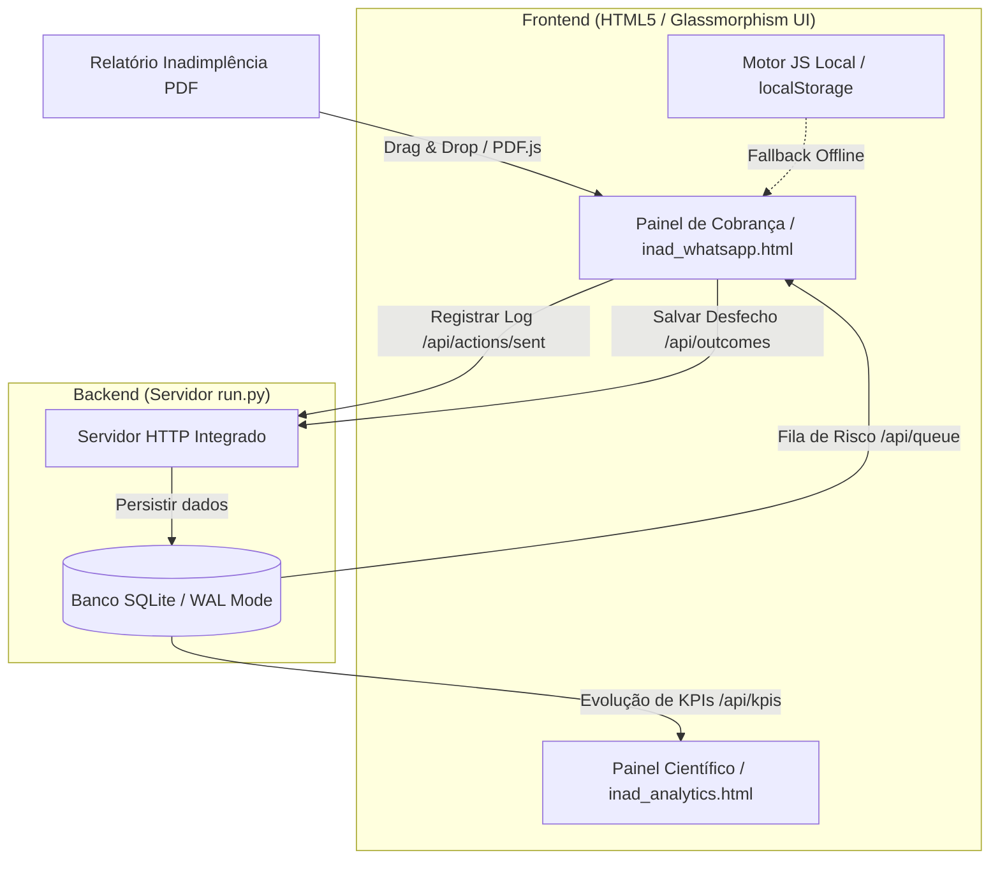

# 🏡 INAD — Painel de Gestão e Cobrança de Inadimplência

[](https://www.python.org/)
[](https://www.sqlite.org/)
[](https://developer.mozilla.org/en-US/docs/Web/CSS)
[](https://pyinstaller.org/)
[](#)

Esta é uma ferramenta profissional de CRM e Gestão de Cobrança desenvolvida para automatizar e otimizar o fluxo de recuperação de inadimplência da construtora. O sistema unifica o processamento de relatórios em PDF, calcula scores de risco inteligentes, classifica devedores em réguas de cobrança operacionais e facilita contatos dinâmicos via WhatsApp Web.

> [!IMPORTANT]
> **Privacidade & Segurança:** Toda a manipulação de dados é realizada **localmente no seu computador** ou na **Intranet da sua empresa**. O banco de dados SQLite (`inad_database.db` / `inad_demo.db`) e os relatórios ficam protegidos no ambiente do servidor local, sem qualquer vazamento de dados confidenciais para a nuvem.

---

## 📐 Arquitetura do Sistema

O INAD possui uma arquitetura híbrida ultra-leve que permite rodar tanto de forma 100% offline (local no navegador) quanto integrada com um servidor centralizado:



---

## ✨ Funcionalidades Principais

- 📊 **Fila de Prioridades Inteligente (`/api/queue`):** Ordenação dinâmica de clientes calculada a partir do cruzamento de valor devedor (P90), dias de atraso (aging) e taxa de reincidência de relatórios.
- 📋 **Worklist Operacional:** Categorização imediata de clientes que precisam de ação urgente:
  - *Promessas Vencidas:* Clientes que prometeram pagar mas não quitaram no prazo da promessa.
  - *Recontato Agendado:* Agendas de ligação e follow-up automáticos para o dia corrente.
  - *Sem Resposta:* Clientes contatados e sem respostas registradas (agrupados automaticamente após envio de WhatsApp).
  - *Novos no Pré-Jurídico:* Devedores que acabam de ultrapassar a barreira crítica dos 120 dias.
- 💬 **WhatsApp Dinâmico Integrado:** Mensagens customizadas geradas automaticamente, incluindo variáveis de saudação baseadas em gênero, identificação do lote/quadra e saldo devedor atualizado, com link direto de disparo.
- 📝 **Registro de Desfechos (Outcomes):** Painel interno em cada card para cadastrar retornos das conversas (*Prometeu Pagar*, *Negociação*, *Recusou*, *Sem resposta*) no formato brasileiro `DD/MM/AAAA`.
- 📁 **Auditoria e Logs de Erro:** Gravação automática de logs operacionais no terminal e registro de exceções de sistema estruturadas no arquivo `inad_errors.log` (multiplataforma).

---

## 💻 Como Baixar e Executar (Tutorial para Colaboradores)

### Passo 1: Obter a Aplicação
1. Vá até a aba de **Releases** do repositório no GitHub.
2. Baixe o pacote comprimido compatível com seu sistema operacional:
   - **Para Windows:** `INAD_Cobranca-Windows.zip`
   - **Para macOS:** `INAD_Cobranca-macOS.zip`
3. Extraia o conteúdo do zip em uma pasta permanente.

---

### Passo 2: Executar no Windows 🪟
1. Abra a pasta extraída.
2. Execute o arquivo **`INAD_Cobranca.exe`** (clicando duas vezes).
3. Uma tela preta de terminal se abrirá no background, e o seu navegador de internet padrão abrirá automaticamente o Painel de Cobrança.
4. *Importante:* Mantenha o terminal aberto enquanto estiver trabalhando. Ao finalizar, basta fechar a janela preta para desligar o sistema.

---

### Passo 3: Executar no macOS (Mac) 🍏
Devido aos termos de segurança do macOS (Gatekeeper), o aplicativo precisará de uma autorização inicial:
1. Abra a pasta extraída no *Finder*.
2. **Clique com o botão direito** no executável **`INAD_Cobranca`** e selecione **Abrir (Open)**.
3. Na janela de aviso de "Desenvolvedor não verificado", clique em **Abrir (Open)**.
4. O navegador abrirá o painel. Nas próximas utilizações, basta abrir o arquivo com dois cliques simples.

---

### Passo 4: Rodando em Servidor / Intranet 🌐
Se você deseja compartilhar a ferramenta com toda a equipe através de um servidor local na rede da construtora:
1. Coloque o projeto no servidor e configure o script `run.py` para escutar na porta ou interface desejada:
   ```bash
   # Executar na porta padrão (8000)
   python run.py
   
   # Executar em uma porta customizada (ex: 9090)
   python run.py --port 9090
   ```
2. O restante dos computadores na rede interna poderá acessar a ferramenta digitando o IP do servidor na barra de navegação (Ex: `http://192.168.1.100:9090`).

---

## ⚙️ Para Desenvolvedores (Rodando via Código)

### Instalação de Requisitos
Instale o Python 3.8+ em sua máquina e garanta o driver SQLite padrão ativo. Para iniciar o servidor de desenvolvimento local:

```bash
# Iniciar o servidor com a base de dados real
python run.py

# Iniciar o servidor em Modo de Demonstração (gera dados de teste fictícios em inad_demo.db)
python run.py --demo

# Iniciar o servidor em Modo Demo escutando em uma porta específica
python run.py --demo --port 9090
```
O painel abrirá automaticamente no endereço correspondente.

### Estrutura dos Arquivos Principais
- `run.py`: Servidor HTTP/API REST nativo em Python com SQLite em modo WAL e gerenciamento de erros estruturado.
- `inad_template.html`: Template base da interface contendo o Design System (CSS) e lógica JS da aplicação.
- `add_pdf_importer.py`: Compilador estático que gera o arquivo autônomo offline `inad_whatsapp.html` a partir do template.
- `inad_analytics.html` / `analytics.js`: Dashboard de inteligência estatística para análise de recuperação.
- `inad_errors.log`: Arquivo gerado automaticamente em caso de exceções não tratadas no servidor para fins de suporte técnico.

### Compilando Binários
Caso precise empacotar uma nova versão executável para distribuição rápida:
```bash
pip install pyinstaller
pyinstaller --onefile --windowed --name=INAD_Cobranca --add-data "inad_template.html;." --add-data "inad_whatsapp.html;." --add-data "inad_analytics.html;." --add-data "analytics.js;." --add-data "analytics.css;." --add-data "libs;libs" run.py
```
*(No macOS, troque o `;` do argumento `--add-data` por `:`).*
